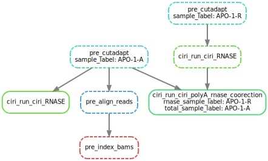

# Basic usage
## Installation
- Yeolab internal users: `module load snakemake`
- or install snakemake yourself

## How to run
On TSCC 2.0, or Slurm system
```
snakemake -s SnakeMain.py \
    -j 12 \
    --configfile YOUR_CONFIG.yaml \
    --cluster "sbatch -t {params.run_time} -n {params.cores} -e {params.error_out_file} -q home-yeo" \
    --use-conda \
    --conda-prefix SOME_OF_YOUR_PATH_TO_STORE_CONDA
```

On TSCC 1.0, or PBS/Torque system
```
snakemake -s SnakeMain.py \
    -j 12 \
    --configfile YOUR_CONFIG.yaml \
    --cluster "qsub -l walltime={params.run_time} -l nodes=1:ppn={params.cores} -e {params.error_out_file} -q home-yeo" \
    --use-conda \
    --conda-prefix SOME_OF_YOUR_PATH_TO_STORE_CONDA
```
## Preparing to run, generate config.yaml
- If you are running the nextera library, see `config/tao_nextera.yaml` as the example
- If you are running the truseq library, see `config/tao_truseq.yaml` as the example
- Yeolab users: Modify `workdir` and `menifest`, the rest are annotations and parameters. 
    - workdir: where outputs will be written
    - menifest: a csv file showing where the fastq locations are. Example file: `/home/hsher/projects/circSTAMP_pipe/notebook/nextera_iter3.csv`:
        - Sample: unique ID of the sample
        - fastq1/2: fastq.gz for read1/2
        - Rnase: whether the sample is RNase treated or not.
        - None of these fields should contain special characters or space! NEVER!
        - `notebook/0_organize_file-Copy1.ipynb` This notebook helps you generate the manifest programatically.

## Output
- `QC/` folder contain quality control statistics
- fastQC contain quality control statistics
- `output/*.gtf` are the CIRI outputs. `{sample_label}.gtf` is the unadjusted quantification. 

## Advanced usage:
# Builing Index
`SnakeBuildIndex.py` does the job to build all indicies needed by CIRI2 and RNA-seq pipeline. After all indices are build, you need to make a config for CIRI file. see `ciriconfig_full.yaml` as an example.

# Preprocessing


```
snakemake -s SnakeMain.py -j 12 --configfile config/tao.yaml --cluster "qsub -l walltime={params.run_time} -l nodes=1:ppn={params.cores} -e {params.error_out_file} -q home-yeo" --use-conda -n --dag output/APO-1-A.gtf output/bams/APO-1-A.Aligned.sortedByCoord.out.bam.bai output/APO-1-A.APO-1-R.gtf | dot -Tsvg > main.svg
```

Can be used to generate the flowchart.

For a pair of polyA depleted (`-A`) samples and the RNase-treated (`-R`) samples, it tries to:
1. Main RNA-seq pipeline: cutadapt trim adaptor, map to genomic sequences
2. CIRI pipeline: run on both samples, then do RNase R correction.

This will generate .bam files that can be fed into the STAMP pipeline.


# STAMP: Sailor pipeline
## Running STAMP on regular RNA-seq (human genome mapped reads)
generates the STAMP configs. `sailor.json`
```
python ../../output_to_json.py /home/hsher/scratch/circSTAMP_pipe/output/bams/ /home/hsher/gencode_coords/GRCh38.primary_assembly.genome.fa /home/hsher/scratch/circSTAMP_pipe/output/sailor/ /home/hsher/scratch/circSTAMP_pipe/output/sailor/sailor.json
```
Then run according to STAMP's documentation.

## Running STAMP on circular RNA mapped reads (experimental.)
`sailor_circ.json` was edited by hand.

CIRI2 find circular RNA reads by repeating the sequence twice (that creates the junction).
However, reads aligned to different sides of the repeated sequence can carry edits that corresponds to the same position on circRNA. This part of the pipeline still lack a scripting part to edit the bam file so that the reads are repositioned to just 1 copy of the sequence.

## Commands to run
see `/home/hsher/scratch/circSTAMP_pipe/run_sailor.sh` for the example 

# Analyzing STAMP pipeline output
`SnakeSailorAnalysis` does the job to find motif and annotate region, transcript names in STAMP edits.
