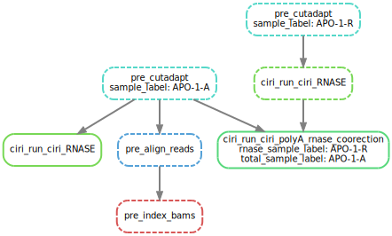

# Builing Index
`SnakeBuildIndex.py` does the job to build all indicies needed by CIRI2 and RNA-seq pipeline. After all indices are build, you need to make a config for CIRI file. see `ciriconfig_full.yaml` as an example.

# Preprocessing


```
snakemake -s SnakeMain.py -j 12 --configfile config/tao.yaml --cluster "qsub -l walltime={params.run_time} -l nodes=1:ppn={params.cores} -e {params.error_out_file} -q home-yeo" --use-conda -n --dag output/APO-1-A.gtf output/bams/APO-1-A.Aligned.sortedByCoord.out.bam.bai output/APO-1-A.APO-1-R.gtf | dot -Tsvg > main.svg
```

Can be used to generate the flowchart.

For a pair of polyA depleted (`-A`) samples and the RNase-treated (`-R`) samples, it tries to:
1. Main RNA-seq pipeline: cutadapt trim adaptor, map to genomic sequences
2. CIRI pipeline: run on both samples, then do RNase R correction.

This will generate .bam files that can be fed into the STAMP pipeline.

## Configuration
see `config/tao.yaml`

the `menifest`:
- Sample: the sample name. Each sample is composed of `prefix` and `suffix`. Suffix can be `-R`(RNase treated). `-A`(not RNase treated). Each prefix must have a pair of samples with two suffixes (this is how CIRI2 runs quantification). If you don't design it this way, comment out `SnakeMain`, rule `all`, line `"output/{sample_pair}.gtf"` to distable RNaseR correction step from CIRI2.
- fastq1, fastq2: full path to fastq.gz files, read1 and read2.
- Rnase, binary variable indicating Rnase treatment is done or not

the rest:
- bunch of index and annotations. Yeolab users don't need to change these.
- if you need to build your own, see `SnakeBuildIndex`. Make sure to change the config file as well as `ciriconfig.yaml`.

## Output

- `QC/` folder contain quality control statistics
- fastQC contain quality control statistics
- `output/*.gtf` are the CIRI outputs. `{sample_label}.gtf` is the unadjusted quantification. `{total_sample_label}.{rnase_sample_label}.gtf` is the RNase-R corrected quantification.

# STAMP: Sailor pipeline
## Running STAMP on regular RNA-seq (human genome mapped reads)
generates the STAMP configs. `sailor.json`
```
python ../../output_to_json.py /home/hsher/scratch/circSTAMP_pipe/output/bams/ /home/hsher/gencode_coords/GRCh38.primary_assembly.genome.fa /home/hsher/scratch/circSTAMP_pipe/output/sailor/ /home/hsher/scratch/circSTAMP_pipe/output/sailor/sailor.json
```
Then run according to STAMP's documentation.

## Running STAMP on circular RNA mapped reads (experimental.)
`sailor_circ.json` was edited by hand.

CIRI2 find circular RNA reads by repeating the sequence twice (that creates the junction).
However, reads aligned to different sides of the repeated sequence can carry edits that corresponds to the same position on circRNA. This part of the pipeline still lack a scripting part to edit the bam file so that the reads are repositioned to just 1 copy of the sequence.

## Commands to run
see `/home/hsher/scratch/circSTAMP_pipe/run_sailor.sh` for the example 

# Analyzing STAMP pipeline output
`SnakeSailorAnalysis` does the job to find motif and annotate region, transcript names in STAMP edits.
