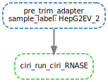

This is a pipeline that trims, maps, detect circluar RNAs, call edits and also call RIPs in circles.
# Basic usage
## Installation
### Snakemake:
- Yeolab internal users: I suggest you to install your own snakemake. The snakemake module on TSCC 2.0 contaminates my python env. `conda create -n snakemake; conda install snakemake==7.3.8`

### Singularity
- Yeolab internal users: `module load singularitypro`. 
- External user: Preferably ask sys admin to install singularity for you.

## How to run
On TSCC 2.0, or Slurm system
```
# install your own snakemake prior to this
conda activate snakemake
module load singularitypro
# 
snakemake -s SnakeMain.py \
    --configfile YOUR_CONFIG.yaml \
    --profile profiles/tscc2 \
    -n
```

On other server, you need to modify profiles/. Check snakemake documentation on how to modify it.

## Preparing to run, generate config.yaml
- If you are running the nextera library, see `config/tao_nextera.yaml` as the example
- If you are running the truseq library, see `config/tao_truseq.yaml` as the example
- Yeolab users: Modify `workdir` and `menifest`, the rest are annotations and parameters. 
    - workdir: where outputs will be written
    - menifest: a csv file showing where the fastq locations are. Example file: `/home/hsher/projects/circSTAMP_pipe/notebook/nextera_iter3.csv`:
        - Sample: unique ID of the sample
        - fastq1/2: fastq.gz for read1/2
        - Rnase: whether the sample is RNase treated or not.
        - None of these fields should contain special characters or space! NEVER!
        - `notebook/0_organize_file-Copy1.ipynb` This notebook helps you generate the manifest programatically.
- If you are running STAMP experiment, see `config/tao_nextera_iter13` as an example. 
- If you are running RIP/Polysome experiment, see `config/tao_nextera_iter11` as an example. 

## Output
- `QC/` folder contain quality control statistics
- fastQC contain quality control statistics
- `output/*.gtf` are the CIRI outputs. `{sample_label}.gtf` is the unadjusted quantification. 

## Advanced usage:
# Builing Index
`SnakeBuildIndex.py` does the job to build all indicies needed by CIRI2 and RNA-seq pipeline. After all indices are build, you need to make a config for CIRI file. see `ciriconfig_full_tscc2.yaml` as an example.

# Preprocessing: Getting circles
This is the most central part of this pipeline, which is to get circles. I didn't do much. Just trim and use CIRIquant pipeline.


```
snakemake -s SnakeMain.smk --configfile config/tao_nextera17_EV.yaml --profile profiles/tscc2 --dag output/HepG2EV_2.gtf | awk '/digraph/{y=1;}y' | dot -Tsvg > main.svg
```

Can be used to generate the flowchart.

- Notice ciriQuant has RNaseR correction, but when I used it the quantification was weird. The differential expression calls will be entierly flipped. We decided to not use the correction.

## normal RNA-seq preprocessing
The pipeline also tries to do general RNA-seq (find linear RNA).


```
# to generate DAG
snakemake -s SnakeMain.smk --configfile config/tao_nextera17_EV.yaml --profile profiles/tscc2 --dag output/bams/HepG2EV_2.Aligned.sortedByCoord.out.bam.bai | awk '/digraph/{y=1;}y' | dot -Tsvg > rnaseq.svg
```

# STAMP experiment:
Due to the pseudocircular reference (duplicate the sequence twice to get the BSJ) generated to map circles, calling edits is complicated. I had to aggregate the edits from the two copies in the pseudocircular reference and then call edits. The code is implemented in `SnakeCircEdit.smk`. To trigger it, add these following fields to your config.

see `configs/circ_nextera_iter13.yaml`
```
STAMP: # the name for STAMP libraries
  - RBM15_STAMP
  - YTHDF2_STAMP
  - U2AF2
  - IGF2BP2
  - YTHDF2

STAMP_control: # the name for APOBEC-only libraries
  - APOBEC1only
  - APOBEC1_1
  - APOBEC1_2

REF_fwd: C # C to T # Define what edit you are looking for
ALT_fwd: T

external_stamp_control: # it is possible to use APOBEC edits in a different folder
   - another_APOBEC_library
      prefix: /PATH/TO/APOBEC_CIRCLE_STAMP/WORKDIR
      sample_name: the_other_apobed

```
Here is what it is doing. It finds edits, and use APOBEC significant edits as background, to find motif around STAMP edits.


```
# to generate DAG
snakemake -s SnakeMain.smk --configfile config/tao_nextera13.yaml --profile profiles/tscc2 --dag output/edits/homer/YTHDF2.APOBEC1_1.homer | awk '/digraph/{y=1;}y' | dot -Tsvg > stamp.svg
```

It uses the alignment generated from the CIRIquant pipeline and find edit in it. Here are some difference from the normal sailor pipeline
- `edit_aggregate_pseudoreference`: Because the alignment is performed on the pseudocircular reference, the same exon is copied twice making 1 single position in the circle appear twice in an alignment file. Counts are aggregated from the two positions prior to testing.
- `edit_pick_from_the_right_strand`: The sequencing protocol is not strand specific, so we only picked edits from the strand where the parent gene is.

# RIP experiment
The pipeline also includes code to call enriched circles. To trigger it to run, add the following:

see `configs/circ_nextera_iter11.yaml`

```
CIRCRIP_PATH: /home/hsher/bin/circRIP # where you downloaded https://github.com/bioinfolabwhu/circRIP/ # leave blank if you have replicates

RIP_comparison: # Here you specify what to use a background and what to use as input, these names have to be in manifest['Sample']
  monosome1:
    ip: PP_Monosome1
    in: PP_Input1
  monosome2:
    ip: PP_Monosome2
    in: PP_Input2
  polysome1:
    ip: PP_Polysome1
    in: PP_Input1
  polysome2:
    ip: PP_Polysome2
    in: PP_Input2

fit_overdispersion_from:
  - PP_Input1
  - PP_Input2
```
- If you have two replicate of Input or RIP, you can use my scripts, which will use replicates to find the dispersion and call circles. This calling method can reproduce several known characteristics of translated circles etc.
- If you have only 1  replicate, you will have to use CIRCRIP. Download the repository to trigger it to run. I don't recommend doing this. Using this software we were not able to find reproducible enriched circles. 

## My way of calling enriched RIP circles

```
# to generate DAG
snakemake -s SnakeMain.smk --configfile config/tao_nextera11.yaml --profile profiles/tscc2 --dag "output/RIP/Mono1.IN1.csv" | awk '/digraph/{y=1;}y' | dot -Tsvg > myrip.svg
```

